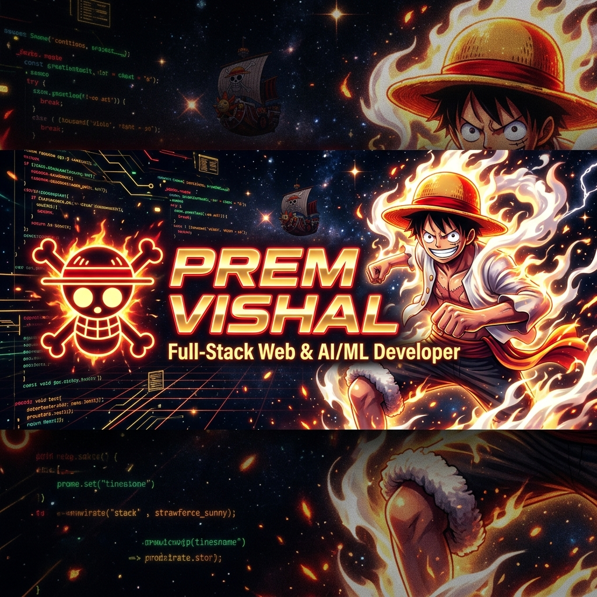
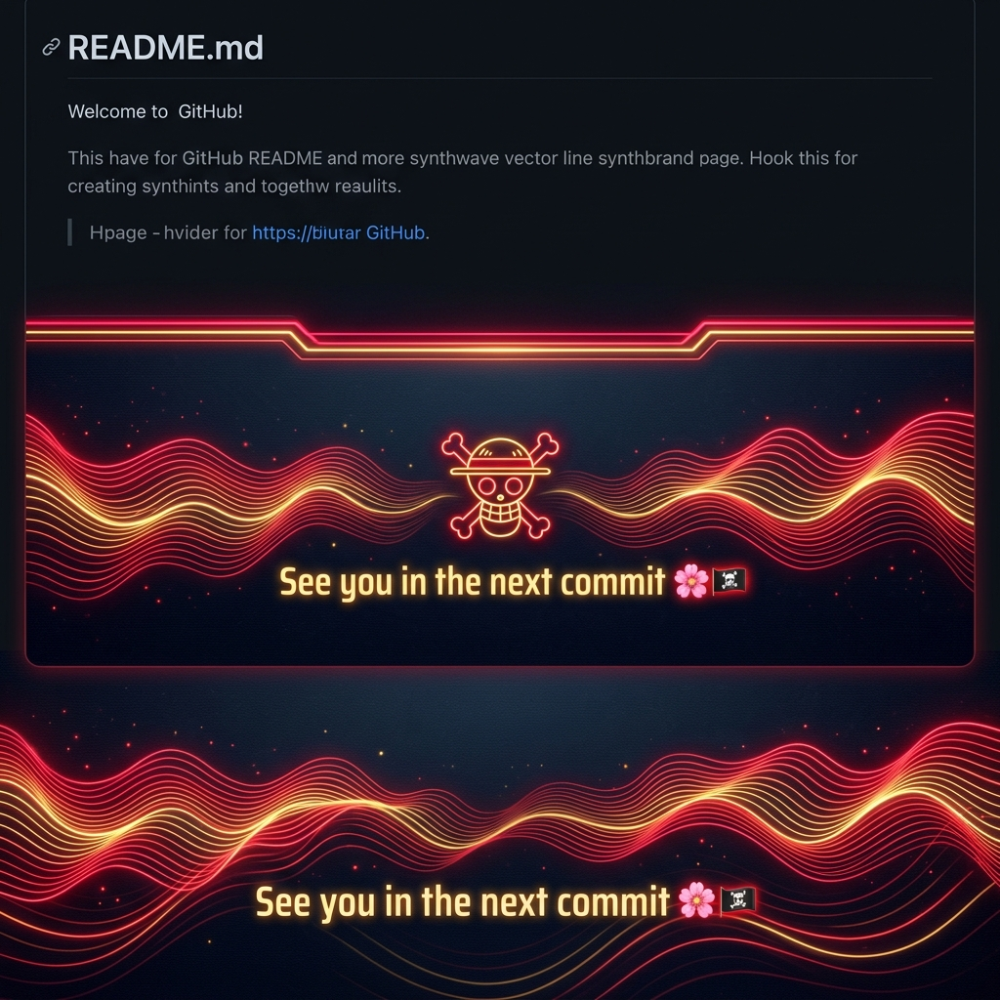

<div align="center">

<!-- HEADER BANNER -->


<br/>

<!-- TYPING SVG TITLE -->
<a href="https://git.io/typing-svg">
  
</a>

<p align="center">
  <b> Software Developer • AI/ML Enthusiast • Cloud & Generative AI Builder • Open Source Sailor </b>
</p>

<!-- PROFILE BADGES -->
<p align="center">
  <a href="https://github.com/PremVishal21">
    
  </a>
  <a href="https://github.com/PremVishal21">
    
  </a>
  <a href="https://github.com/PremVishal21">
    
  </a>
  <a href="https://www.linkedin.com/in/prem-vishal-362ba22a1">
    
  </a>
</p>

<!-- LUFFY BOUNTY CARD BANNER -->
<p align="center">
  
  
</p>

</div>

---

## 🧑‍💻 About Me

<table>
  <tr>
    <td width="65%" valign="top">
      <h3>🏴‍☠️ Ahoy! I'm Prem Vishal</h3>
      <p>
        I am a passionate <b>Software Developer</b> and <b>AI/ML Engineer</b> with hands-on experience building scalable full-stack web applications, cloud-native SaaS platforms, and intelligent Generative AI agents. Driven by curiosity and the spirit of adventure, I build tech solutions that solve complex real-world challenges!
      </p>
      <ul>
        <li>💻 <b>Full Stack & AI/ML Specialist</b>: Building robust web apps using React, Node.js, Python & PyTorch.</li>
        <li>🎓 <b>Google Student Ambassador</b>: Representing Google technologies and mentoring 300+ tech students.</li>
        <li>🧠 <b>Generative AI Practitioner</b>: Developing context-aware LLM workflows with Google Gemini API, Vertex AI & ADK.</li>
        <li>🏆 <b>Hackathon Builder</b>: Architected <i>Civitus AI</i> for Google Cloud Hackathon using GCP Pub/Sub & AlloyDB Vector.</li>
        <li>🛠️ <b>Experience</b>: AI/ML Intern @ <i>BLACKBUCKS</i> | Web Dev Intern @ <i>ZIDIO</i> | Prompt Engineer @ <i>Vault of Codes</i>.</li>
        <li>🎯 <b>Current Goal</b>: Master System Design, Cloud Architecture, and build products that empower millions.</li>
        <li>🍖 <b>Pirate Creed</b>: <i>"If you don't take risks, you can't create a future!"</i> — Monkey D. Luffy</li>
      </ul>
    </td>
    <td width="35%" align="center" valign="middle">
      
      <br/>
      <sub><b>Captain Prem Vishal</b><br/><i>Coding at Gear 5 Speed ⚡</i></sub>
    </td>
  </tr>
</table>

---

## 💻 Tech Stack & Tools

<p align="center">
  <b>Languages</b><br/>
  
  
  
  
  
  
</p>

<p align="center">
  <b>Frontend & Styling</b><br/>
  
  
  
  
  
</p>

<p align="center">
  <b>Backend & Databases</b><br/>
  
  
  
  
  
  
  
  
</p>

<p align="center">
  <b>AI / ML & Cloud DevOps</b><br/>
  
  
  
  
  
  
  
  
  
  
</p>

<p align="center">
  <b>Design & Dev Tools</b><br/>
  
  
  
  
  
</p>

---

## 📌 Featured Projects

<table width="100%">
  <tr>
    <td width="50%" valign="top">
      <h3>🚀 Civitus AI</h3>
      <p><b>Community Decision Intelligence Platform</b> (Google Cloud Hackathon)</p>
      <ul>
        <li>Architected real-time event streaming pipeline on <b>GCP Cloud Run, Pub/Sub & BigQuery</b>.</li>
        <li>Implemented AI Orchestration layer with <b>Vertex AI Agent Development Kit (ADK)</b> and <b>AlloyDB Vector</b>.</li>
        <li>Consolidates civic, environmental, traffic, and emergency data into unified decision intelligence.</li>
      </ul>
      <p>
        
        
      </p>
    </td>
    <td width="50%" valign="top">
      <h3>🤖 AI Powered Chatbot</h3>
      <p><b>Gemini AI Assistant & Workflow Engine</b></p>
      <ul>
        <li>Context-aware conversational assistant built with <b>Google Gemini API</b>.</li>
        <li>Supports automated code generation, image-to-code synthesis, and complex debate analysis.</li>
        <li>Designed API-driven LLM orchestration without expensive custom model re-training.</li>
      </ul>
      <p>
        
        
      </p>
    </td>
  </tr>
  <tr>
    <td width="50%" valign="top">
      <h3>🛒 Thrift 'n' Drift</h3>
      <p><b>SaaS E-Commerce Platform</b></p>
      <ul>
        <li>Full-stack SaaS application built for modern discovery and seamless shopping experiences.</li>
        <li>Responsive React.js UI, RESTful back-end API workflows, and robust state management.</li>
        <li>Designed with emphasis on performance, component reusability, and user-centered design.</li>
      </ul>
      <p>
        
        
      </p>
    </td>
    <td width="50%" valign="top">
      <h3>🎨 AI Community Intelligence Dashboard</h3>
      <p><b>Product Design Case Study & Wireframes</b></p>
      <ul>
        <li>Designed an enterprise-grade UI/UX product experience for civic data monitoring and AI alerts.</li>
        <li>Created full information architecture, design system, high-fidelity prototypes in <b>Figma</b> & Google Stitch.</li>
      </ul>
      <p>
        
        
      </p>
    </td>
  </tr>
</table>

---

## 💼 Experience & Roles

```
🏢 BLACKBUCKS          │ AI/ML Intern                │ Oct 2025 – Apr 2026
                       │ Built 5+ AI/ML predictive apps & optimized ML model pipelines.
───────────────────────┼─────────────────────────────┼────────────────────────────
💻 ZIDIO               │ Web Development Intern      │ Sep 2025 – Dec 2025
                       │ Developed 5+ responsive React/Node web apps & REST APIs.
───────────────────────┼─────────────────────────────┼────────────────────────────
⚡ Vault of Codes      │ AI & Prompt Engineer Intern │ May 2025 – Jun 2025
                       │ Designed prompt engineering workflows & evaluated LLM quality.
───────────────────────┼─────────────────────────────┼────────────────────────────
🎓 Google              │ Google Student Ambassador   │ Aug 2025 – Dec 2025
                       │ Led technical workshops & engaged 300+ students in Google Tech.
```

---

## 🎓 Education & Certifications

<table width="100%">
  <tr>
    <td width="50%" valign="top">
      <h4>🎓 Education</h4>
      <ul>
        <li><b>B.Tech in Computer Science & Engineering (CSE)</b><br/>Christu Jyothi Institute of Technology & Sciences (2023 – 2027)</li>
        <li><b>Pre-University Course (Intermediate)</b><br/>Rajiv Gandhi University of Knowledge Technologies (RGUKT Basar IIIT) (2021 – 2023)</li>
      </ul>
    </td>
    <td width="50%" valign="top">
      <h4>📜 Key Certifications</h4>
      <ul>
        <li><b>Google Cloud Skills Boost</b>: Engineer AI Agents with ADK</li>
        <li><b>Infosys Springboard</b>: Fine Tuning Large Language Models</li>
        <li><b>Blackbucks</b>: Artificial Intelligence & ML Engineer</li>
        <li><b>AWS Educate</b>: Machine Learning Foundations</li>
        <li><b>Udemy</b>: Introduction to LLMs in Python & Generative AI Masterclass</li>
      </ul>
    </td>
  </tr>
</table>

---

## 📈 GitHub Analytics & Stats

<div align="center">

<table border="0">
  <tr>
    <td>
      
    </td>
    <td>
      
    </td>
  </tr>
  <tr>
    <td colspan="2" align="center">
      
    </td>
  </tr>
</table>

<br/>

### 🏆 GitHub Trophies


</div>

---

## 📈 Contribution Activity Graph

<div align="center">
  
</div>

---

## 🌐 Let's Connect

<p align="center">
  <a href="https://www.linkedin.com/in/prem-vishal-362ba22a1">
    
  </a>
  <a href="https://github.com/PremVishal21">
    
  </a>
  <a href="mailto:shoviasj@gmail.com">
    
  </a>
</p>

---

<!-- FOOTER SECTION -->
<div align="center">

  <h3>See you in the next commit 🌸🏴‍☠️</h3>

  

  <br/>

  <sub>Designed with ❤️ and Straw Hat Spirit for <b>Prem Vishal</b></sub>

</div>
